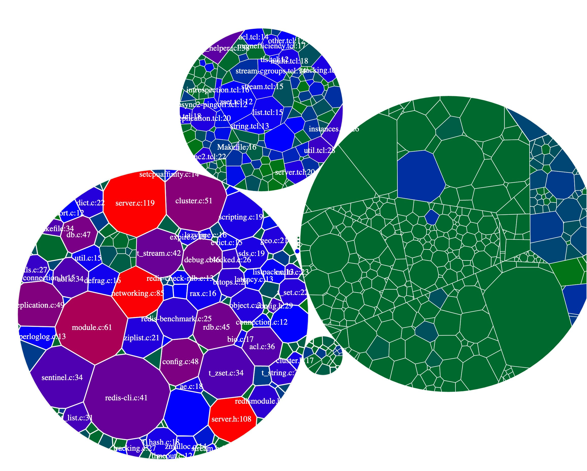
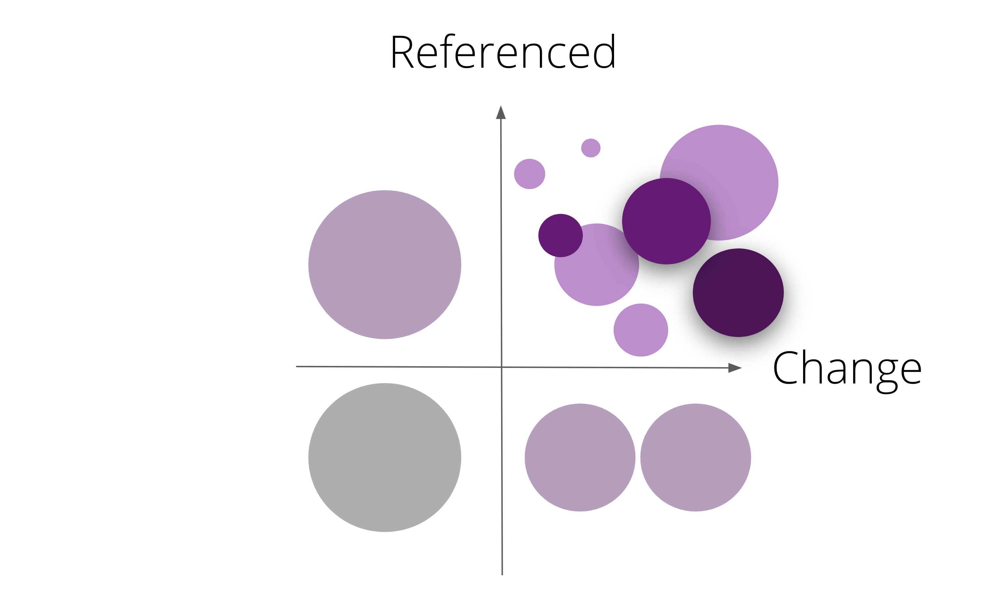
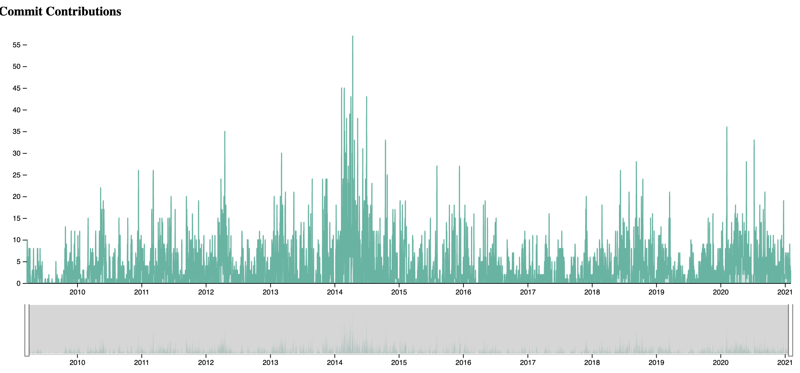
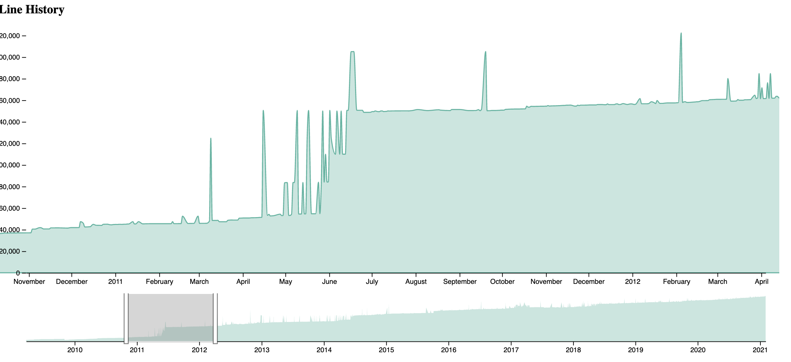
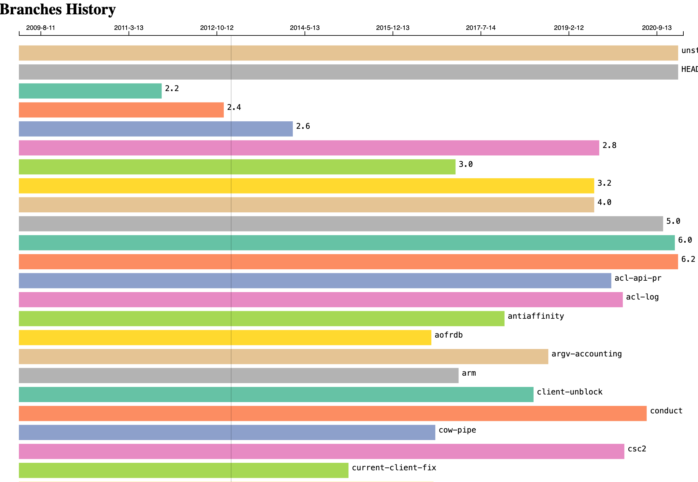
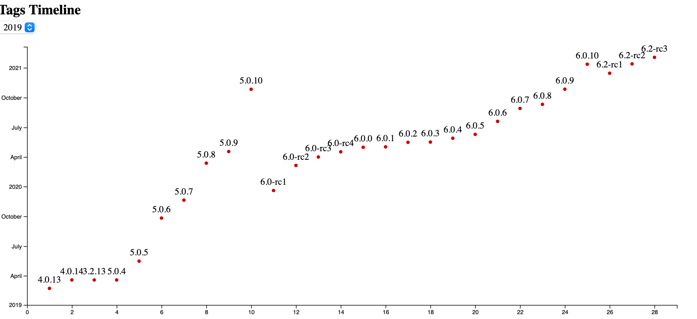
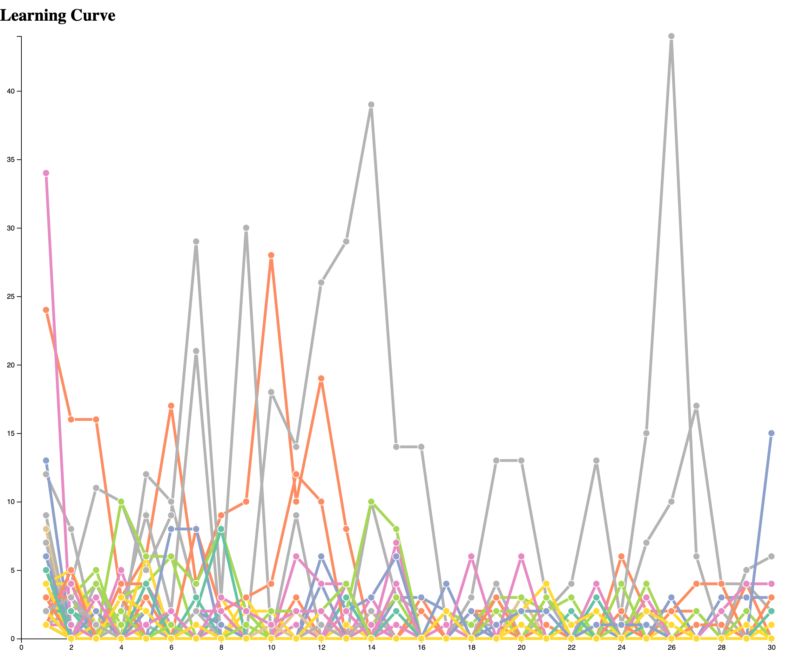
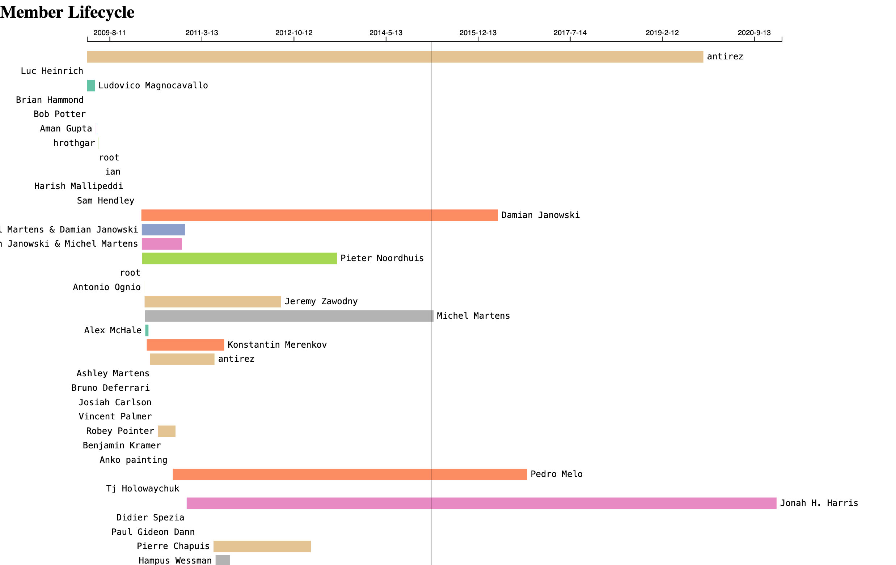

# 只懂 Git 如何成为架构砖家？代码的物理分析

物理分析这一词，来源于我同事 @NoaLand 所推荐的《大规模 C++ 程序设计》一书中所介绍的物理设计。

> 物理设计集成于研究系统中的物理实体，及它们之间如何相互关联。逻辑设计只研究体系结构（架构）问题，物理设计研究组织问题。

在粗粗了这本书的一些概念之后，我对整体的物理设计思路有更深入的了解。于是，在结合了《系统重构与迁移指南》一书中引入的『四级重构』，重新论证了我先前的一个想法：并不需要成为 xx 语言的熟练开发者，我也能分析这个语言的系统设计得是否合理？ （PS：这是建立在我已经熟练使用多门语言 Copy/Paste 的前提下。）

于是乎，只需要学会对物理设计进行分析，就能成为架构上的砖家 —— 对于这部分的分析，是个程序员都会做。

而一系列的理论建立在几个基本的前提之下：

1. 代码组件方式使用文件系统的方式组件。即包和组件使用文件夹管理等。
2. 项目使用的是 Git，绝大多数的 Git 修改都是自然发生的，即技术需求和业务需求。
3. 项目所使用的是主流的企业开发语言。如 Java、Golang、JavaScript/TypeScript、C#、C++ 等，而不是 Haskell 等。

这里，我们使用的分析工具是 Inherd 开源小组开发的研发效能分析工具 Coco，GitHub：https://github.com/inherd/coco。

文中使用的是 Redis 案例在线版本见：[https://inherd.org/cases/redis/](https://inherd.org/cases/redis/)

## “物理”架构设计

我们所熟知的包，可以定义为：**一个包就是被组织成一个物理内聚单位的组件集合**。而包的呈现形式便是文件夹，其中的一个个物理单元就是文件。通过对文件的修改的监测，我们可以知道文件夹的变化，进而观测到整个包的变化。

通过这些物理上的变化，我们可以知道一个包是否是稳定的，从它的大小，我们还能知道整体的设计是否合理。如下是 自 2020.3.1 号起， Redis 中不同模块的源码变化情况：

（PS：该图是交互式的网页。左侧的五彩斑斓部分是 src/，也就是主要源码，右侧是依赖的了模块，上方是测试模块的变化。）

从上图中：

1. **观测频繁修改模块**。可以清晰地看到哪个模块变化较多。对于业务代码来说，我们则可以通过时间轴的大小，来观测不同时代段的修改。
2. **了解包的大小**。如图中的 `redis-cli.c:41`，其中的 41 是自 2020.3.1 起的修改次数，hover 在上面之后，可以知道这个文件的行数为 7012 行。

根据我们《系统重构与迁移指南》定义的高引用、高修改的关系：

我们也可以建议一个轻微地模型（不会那么准确），来证明一个长行数 + 频繁修改这是一个非常不稳定、容易出错的包。而在业务场景之下，如果我们实现的一个功能，为于 A 业务之下，但是一直在修改 B 业务，那么说明引用是不正确的，存在一定的耦合度

## 变更频率

变更频率是一个非常有意思的指标，从版本管理工具中，我们可以获得历史上发生的一些变化。从结论上来说，我们常知道的一些事实有：

1. 随着代码行数的上升，新增代码的占比会越来越少，修改成本也越来越高，因此提交量会呈一定的下降趋势。
2. 软件开发是周期性的活动。修改频率与软件发布成正比例关系。

下图展示的是 Redis 的所有提交与时间的关系：

从图上来看，在 2014 ~ 2015 之前发生了大量的代码提交。与它与后面的发布频率，做一个对比，我们就会发现这一段时间发布了大量的新版本。从这些现象来看，它**可能**意味着：

1. 在这段时间引入了大量的功能。
2. 因为过多的功能，并因此引入了大量的 bug，所以需要更多地版本发布。

除此，另外一个不是那么有意思的指标就是行数上的变化：

从图中我们可以看到在 2011 ~ 2012 这个时间点上，代码量突然发生了剧烈的变化。其中原因，我想就是因为他们所采用的是 feature branche 的机制。即，功能在开发完成后，才会合并到主分支。

从下面的发布频率中，我们也可以看到这个变化的趋势。

## 发布频率与部署

从 Git 中想看到发布频率相关的内容，只能从以下两部分：

1. 分支。可以展示分支的使用情况，以及不同分支的变化。
2. Git Tag。展示软件的发布频率与时间等的关系。

如下是 Redis 的分支历史：

从图中，我们可以清晰地看到 Redis 的不同特性地开发，如 `arm`，如 `acl-log`。除此，还有不同版本的维护情况，如 2.8 的修改在 3.0 之后。

同样的，因为 Redis 采用的是标准的 Git 实践来发布软件。所以，从 2019 年的 tags，我们可以看到软件的整体发布情况：

咦，从上图来看，这个是 6.0 是不是来得非常快。没有 5.1.x 就直接 666 了。

## 学习成本与知识管理

> 软件开发是一个知识生产和消费的过程。 —— 《软件开发管理为什么这么难》

在一个项目的不同时期（技术准备、业务回补、成长优化、架构演进），其对于不同级别的开发人员的难度都是不一样的。这一点从理论上来讲，我们可以从分析其的提交资料，来分析它的学习成本。开发人员的提交量会随着在项目的年限逐渐变多，直到趋于稳定。

于是，我们尝试从 Redis 项目里建立这个模型：

然后失败了。后来，发现这个模式并不适合于开源项目。

> 与商业软件相比，开源软件的更加动态，团队的生命周期很少超过六个月，并且常常会以各种方式重组。——《软件之道：软件开发争议问题剖析》

但是，我们相信它对于常规的软件开发团队是适用的。

随后，我们再正视了一下这个问题，重新考量了适合于开源项目的模型 —— 通过人员在项目的提交时间，来看一个项目是否稳定，知识传播是否靠谱。

如下是 Redis 项目中，开发人员的第一次提交时间和最后一次开发时间产生的 timeline：

它从侧面反应了，开源项目的团队模式，只有少数的开发人员。对于商业软件来说，如果 timeline 如上的话，那么这个软件仍然能够开发下去。但是，如果核心开发人员离开团队，项目将非常不稳定，那么这个软件将充斥着大量未知的 bug。

## 其它

这样一看，Coco 是不是降低了架构分析的门槛。欢迎试用 Coco，可以从 GitHub 直接下载：https://github.com/inherd/coco/releases

文中说的一些分析内容，已经在我之前的另外一分析工具 Coca 中引入过。但是，受限于语法分析的成本，所以在 Coco 中采用了轻量级的分析方式。我们会在后续的文章中，介绍更多想多的实现方式。你也可以通过添加微信号 `phodal02` （注明 Inherd），参与到相关的讨论中。

文中使用的是 Redis 案例在线版本见：[https://inherd.org/cases/redis/](https://inherd.org/cases/redis/)

相关资源：

 - 《[Introducing the Polyglot Code Explorer](https://blog.korny.info/2020/09/06/introducing-the-polyglot-code-explorer.html)》
 - 《Your code as a crime scene》